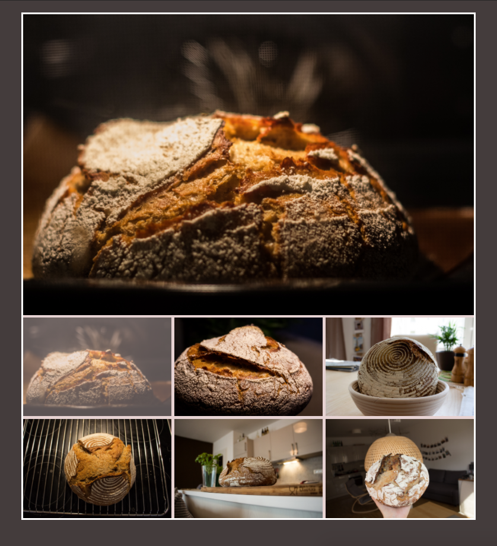

A small tool that shows a few of my favourite bread recipes.

- Simple API with Python's Flask micro web framework.
- Super lightweight css grid front-end.
- Yet performant integration with a mongoDB database. 

-----

Usage: 

- Run mongoDB: [guide here](https://docs.mongodb.com/manual/tutorial/install-mongodb-on-os-x/#run-mongodb-community-edition)

- Import json or csv file into running mongoDB. Doesn'r really matter if you import a json file or a csv file. Whatever you prefer 

```
mongoimport --db homemade_bread --collection bread --file bread.json
```
			
or

```
mongoimport --db homemade_bread --collection bread --type csv --fields _id, name, link --file bread.csv
```


- Run `python3 app.py`

- Open `home.html` and click on image to get a link to its recipe


The interation with grid csv can be seen here, without the connection to the database: [Link](https://alyonavyshnevska.github.io/assets/projects/homemade_bread/). 



